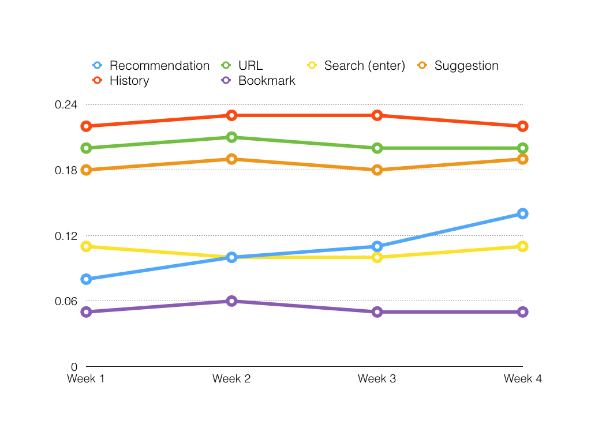
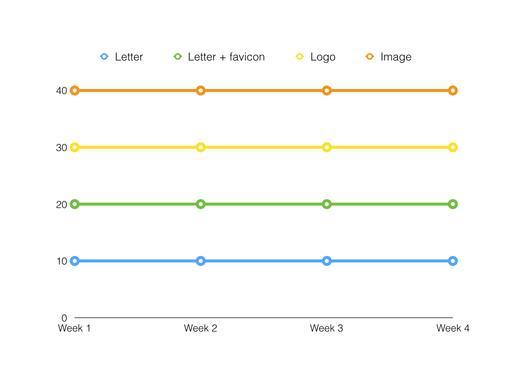

# Universal Search Metrics

A summary of the metrics the Universal Search add-on and recommendation server will record.

**Definitions:**

- **URL bar** — the unified address + search bar at the top of the browser.
- **Popup** — the popup that appears when you begin typing into the URL bar.
- **Search** — the full lifecycle, beginning when the user types a key into the url bar, and ending when the user either chooses an item from or otherwise dismisses the popup.

## Data collection

Metrics gathered from the Universal Search add-on will be reported to the Test Pilot add-on, which will augment that information and relay it to Firefox's telemetry system via `submitExternalPing`. This is not currently implemented on the Test Pilot side; those efforts are encompassed by [issue #234](https://github.com/mozilla/testpilot/issues/234).

### On the client

Universal Search will record and report each of the following events:

- User selects a recommendation.
	- Time from search start to search completion.
	- Length of query when selected.
	- List of enhancers applied (e.g. `Object.keys(recommendation.enhancements)`.
	- Value of the recommendation's `data-type` attribute. _(NB: this likely won't matter in early experiments. This is intended to allow explicit monitoring of qualitative types of results, e.g. "movie cards".)_
- User enters a URL.
	- Time from search start to search completion.
- Use directly searches using their default search engine.
	- Time from search start to search completion.
	- Length of query.
- User selects a suggested search term.
	- Time from search start to search completion.
	- Length of query.
	- Levenstein distance between query and completed search term.
- User selects a bookmark.
	- Time from search start to search completion.
	- Length of query.
- Use selects an item from history.
	- Time from search start to search completion.
	- Length of query.
- The user terminates a search.

This data will be used in three ways:

1. To gain a deeper understanding of the value of our recommendations to users.
2. To gain a deeper understanding as to how users engage with the URL bar, search popup, and our recommendations.
3. To segment users of other metrics.

### On the server

To gain a better understanding of how users make use of the URL bar, the recommendation server will maintain logs of queries passed to it. For each request, we will record:

- The query string itself.
- The HTTP status code of the response.
- The enhancers applied to that query (i.e. `recommendation.enhancements.keys()`)

We do not wish to record individual users browsing habits; we're interested in aggregations of user behavior. Thus, we will not record any queries that:

- Are longer than 20 characters.
- Appear to begin with a protocol (`^[^\s]+\:\S`).
- Appear to be a hostname (`^[^\s]+\.\S`)

Additionally, we will discard outliers on a schedule:

- Any queries that have only been made once.
- Any queries longer than 6 characters that have been made less than 10% as frequently as the most common query of that length (e.g. if the most frequently-made 8-character query has been made 1000 times, all 8-character queries made fewer than 100 times will be discarded).

## Data analysis

The collected data will primarily be used to answer the following questions. Images are used for visualization and are not composed of actual data.

### Key performance indicators

#### Recommendation usage rates

_When a result is chosen, how often is it a recommendation? How often do users choose the different types of recommendations?_

This will allow us to understand the overall effectiveness of our recommendations along with how the different types perform so that we can decide what to show and when to show it.

#### User retention

_Do users continue to use recommendations? As we improve the recommendations, are they more likely to stick around?_

This will allow us to understand overall retention. A user is considered retained if they use at least one recommendation each week.

### Additional analysis

#### Result types

_What are the most common uses of the Awesome Bar?_

This will give us a better understanding of how people are using the Awesome Bar now so that we can see how recommendations affect that. It will also allow us to devise new tests in the future.

#### Rich data

_Does richer data entice users to click more often?_

We want to validate that rich data (icons and images) makes it easier for users to choose a recommendation. By tracking click through rates based on the amount of rich data, we can get an understanding of which data types are most impactful.

