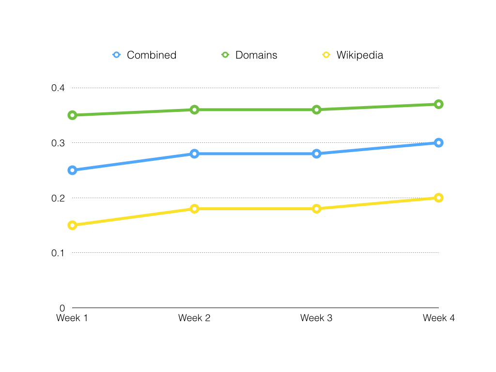
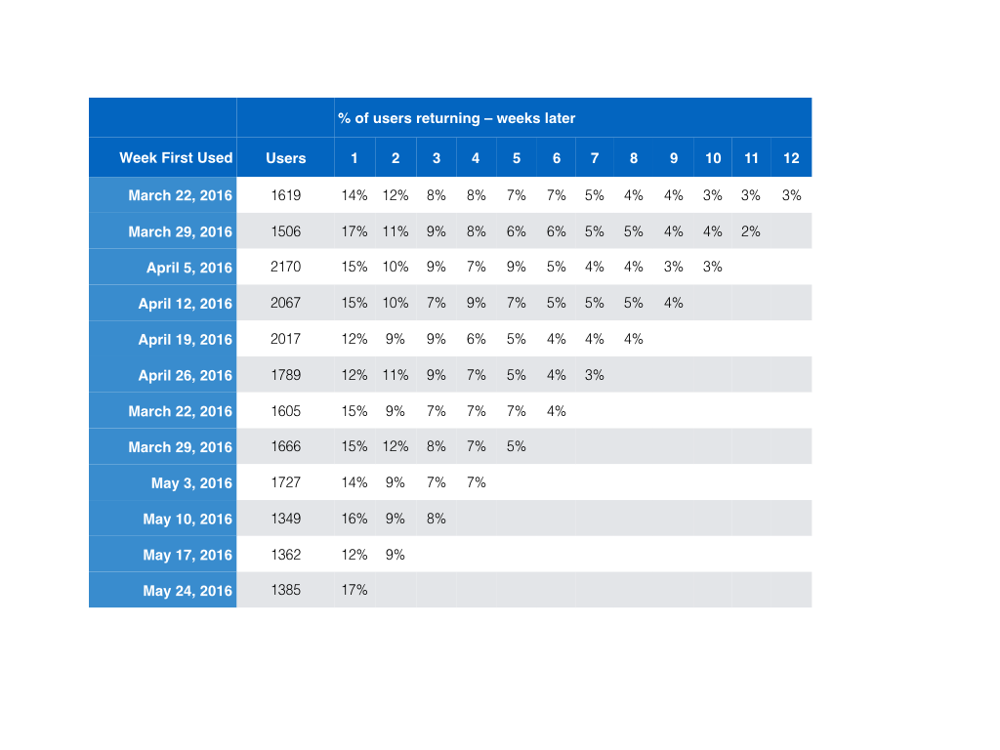

# Universal Search Metrics

A summary of the metrics the Universal Search add-on and recommendation server will record.

**Definitions:**

- **URL bar** — the unified address + search bar at the top of the browser.
- **Popup** — the popup that appears when you begin typing into the URL bar.
- **Search** — the full lifecycle, beginning when the user types a key into the url bar, and ending when the user either chooses an item from or otherwise dismisses the popup.
- **Recommendation** - the recommendation UI inserted into the popup by this add-on.


## Data collection

Metrics gathered from the Universal Search add-on will be reported to the Test Pilot add-on, which will augment that information and relay it to Firefox's telemetry system via `submitExternalPing`. This is not currently implemented on the Test Pilot side; those efforts are encompassed by [issue #234](https://github.com/mozilla/testpilot/issues/234).


### On the client

#### The popup lifecycle

- The popup usually opens when the user types in the urlbar. It also opens in some less common circumstances, like clicking the history drop marker (the small down caret to the right of the urlbar).
- The popup closes when the user navigates or dismisses the popup without navigating.
  - The popup can be dismissed without navigating by hitting the 'Escape', left arrow, or right arrow keys.
  - The user can navigate by clicking a result in the popup, or by using the arrow or Tab keys to highlight a result in the popup, then hitting Enter.
  - The user can also navigate by typing in the urlbar and hitting Enter, without ever interacting with the popup.

#### Measuring the popup lifecycle

Each time the popup is closed, we record some facts about Firefox's state:

- `didNavigate`: was the popup closed because the user navigated, or because the popup was dismissed without navigating (for example, using the Escape key)?
- `interactionType`: if the user did navigate, was the selected item clicked or keyed?
- `recommendationShown`: was a recommendation visible when the popup was closed?
- `recommendationType`: if a recommendation was shown, was it a wikipedia or a top-level domain recommendation?
  - These types will grow over time, as we add new kinds of recommendations.
- `recommendationSelected`: if the user navigated, and if the recommendation was visible, did the user navigate to the recommendation URL?
- `selectedIndex`: if the user navigated to an item in the popup, which item was selected?
  - For instance, if the third non-recommendation result was clicked, `selectedIndex` would have a value of 2.
  - If the recommendation was selected, the `selectedIndex` value will be -1.

Here's a rough schema:

```js
{
  didNavigate: true or false
  interactionType: 'click' or 'key'
  recommendationShown: true or false
  recommendationSelected: true or false
	recommendationType: 'tld' or 'wikipedia'
  selectedIndex: an integer between -1 and 30 inclusive
}
```

Here's an example of a complete telemetry ping:

```js
{
	"test": "universal-search@mozilla.com",  // The em:id field from the add-on
	"agent": "User Agent String",
	"payload": {
		"didNavigate": true,
		"interactionType": "click",
		"recommendationShown": true,
		"recommendationType": "tld",
		"recommendationSelected": true,
		"selectedIndex": -1
	}
}
```

#### Data Analysis

We will use this data to calculate click-through rates (CTR) for the popup as shown below.

- CTR of the popup overall: number of events with `didNavigate = true` / total event count
- CTR when recommendations are shown: (number of events with `didNavigate = true` and `recommendationShown = true`) / (total events with `recommendationShown = true`)
- CTR when recommendations are not shown: (number of events with `didNavigate = true` and `recommendationShown = false`) / (total events with `recommendationShown = false`)
- CTR when wikipedia recommendations are shown: (number of events with `didNavigate = true` and `recommendationType = wikipedia`) / (total events with `recommendationType = wikipedia`)
- CTR when TLD recommendations are shown: (number of events with `didNavigate = true` and `recommendationType = tld`) / (total events with `recommendationType = tld`)
- When users navigate via the popup, how often do they use the mouse: (number of events with `didNavigate = true` and `interactionType = click`) / (total events with `didNavigate = true`)
- When users navigate via the popup, how often do they use the keyboard: (number of events with `didNavigate = true` and `interactionType = key`) / (total events with `didNavigate = true`)
- CTR for the nth result down the list: (number of events with `didNavigate = true` and `selectedIndex == n`) / (total events with `didNavigate = true`)
  - We'll use this formula to generate a histogram for the various values of `selectedIndex`.

By using CTR as a proxy for helpfulness, we can use these CTRs to measure whether recommendations are helpful overall, and which types are most or least helpful.

### On the server

To gain a better understanding of how users make use of the URL bar, the recommendation server will maintain logs of queries passed to it. For each request, we will record:

- The query string itself.
- The HTTP status code of the response.
- The enhancers applied to that query (i.e. `recommendation.enhancements.keys()`)

We do not wish to record individual users browsing habits; we're interested in aggregations of user behavior. Thus, we will not record any queries that:

- Are longer than 20 characters.
- Appear to begin with a protocol (`^[^\s]+\:\S`).
- Appear to be a hostname (`^[^\s]+\.\S`)

Additionally, we will discard outliers on a schedule:

- Any queries that have only been made once.
- Any queries longer than 6 characters that have been made less than 10% as frequently as the most common query of that length (e.g. if the most frequently-made 8-character query has been made 1000 times, all 8-character queries made fewer than 100 times will be discarded).

The logs will be printed to stdout in the standard [mozlog format](https://github.com/mozilla-services/Dockerflow/blob/master/docs/mozlog.md):

```json
{
    "EnvVersion": "2.0",
    "Hostname": "socket.gethostname()",
    "Logger": "universalSearch",
    "Pid": 9,
    "Severity": 6,
    "Timestamp": 1459980510934186496,
    "Type": "request.summary",

    "Fields": {
        "agent": "Mozilla/5.0 (Macintosh; Intel Mac OS X 10.11; rv:48.0) Gecko/20100101 Firefox/48.0",
        "errno": 0,
        "lang": "en-US,en;q=0.5",
        "method": "GET",
        "path": "/",
        "t": 35,

        "classifiers": [
            "keyimage",
            "favicon"
        ],
        "predicates": {
            "is_protocol": false,
            "query_length": false,
            "is_hostname": false
        },
        "query": "the mart",
        "status_code": 200
    }
}
```


#### Standard `mozlog` data

* `EnvVersion`: `"2.0"`, static.
* `Hostname`: the hostname, as reported by Python's `socket.gethostname()` function.
* `Logger`: `"universalSearch"`, static.
* `Pid`: the process number.
* `Severity`: the [syslog security level](https://en.wikipedia.org/wiki/Syslog#Severity_level), mapped from the [Python log type](https://docs.python.org/3/library/logging.html#logging-levels).
* `Timestamp`: the unix timestamp of the log.
* `Type`: `"request.summary"`, static.


#### Standard `request.summary` fields

* `Fields.agent`: the request's user agent string.
* `Fields.errno`: 0 if the response status code is < 400; otherwise the response status code.
* `Fields.lang`: the request's `Accept-Language` header.
* `Fields.method`: the request's method.
* `Fields.path`: the request's path.
* `Fields.t`: the number of ms elapsed in the processing of the request.


#### Custom fields

* `Fields.classifiers`: an array of classifiers applied to the result. Not collected if any predicates are `true`.
* `Fields.predicates`: an object of predicates to further data collection; if any of these are `true`, no query data is recorded.
    * `Fields.predicates.is_hostname`: `true` if the query appears to be a hostname.
    * `Fields.predicates.is_protocol`: `true` if the query appears to begin with a protocol.
    * `Fields.predicates.query_length`: `true` if the query is longer than 20 characters.
* `Fields.query`: the value of the `q` querystring parameter. Not collected if any predicates are `true`.
* `Fields.status_code`: the HTTP status code of the response. Not collected if any predicates are `true`.


## Data analysis

The collected data will primarily be used to answer the following questions. Images are used for visualization and are not composed of actual data.


### Key performance indicators


#### Recommendation usage rates

_When a result is chosen, how often is it a recommendation? How often do users choose the different types of recommendations?_

This will allow us to understand the overall effectiveness of our recommendations along with how the different types perform so that we can decide what to show and when to show it.




#### User retention

_Do users continue to use recommendations? As we improve the recommendations, are they more likely to stick around?_

This will allow us to understand overall retention. A user is considered retained if they use at least one recommendation each week.




### Additional analysis


#### Result types

_What are the most common uses of the Awesome Bar?_

This will give us a better understanding of how people are using the Awesome Bar now so that we can see how recommendations affect that. It will also allow us to devise new tests in the future.


#### Rich data

_Does richer data entice users to click more often?_

We want to validate that rich data (icons and images) makes it easier for users to choose a recommendation. By tracking click through rates based on the amount of rich data, we can get an understanding of which data types are most impactful.


